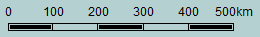

# leaflet-double-scale
>


## Description
A graphic scale for Leaftlet with metric and/or nautical scale(s)

Based on [leaflet-graphicscale](https://github.com/nerik/leaflet-graphicscale) by [Erik Escoffier](https://github.com/nerik) 

## Installation
### bower
`bower install https://github.com/FCOO/leaflet-double-scale.git --save`

## Demo
http://FCOO.github.io/leaflet-double-scale/demo/ 

## Usage

    L.control.doubleScale( {
    			type: 'both',
    			position: 'bottomleft', 
    			backgroundColor: 'white',
    			opacity: 0.4,
    			maxUnitsWidth: 300, 
    		}).addTo(map);


## Options

### type: ```'metric'|'nautical'|'both'```
Default: `metric`

- 'metric'



- 'nautical'


- 'both'


### position
leaflet.Control [options.position](http://leafletjs.com/reference.html#control-options)

### backgroundColor
Default: `white`

### opacity
The opacity of the background of the scale
Default: `0.4`

### maxUnitsWidth
Max width of the scale
Default: `200`

## Properties and methods
	.outerElement //DOM-element that contains the scale. 

	.onClick( func, context ) //Add click-event to the scale. Change style on mouse hover to border and less transparent 

## Copyright and License
This plugin is licensed under the [MIT license](https://github.com/FCOO/leaflet-double-scale/LICENSE).

Copyright (c) 2015 [FCOO](https://github.com/FCOO)

## Contact information

Niels Holt nho@fcoo.dk


## Credits and acknowledgements
Erik Escoffier <https://github.com/nerik> 

